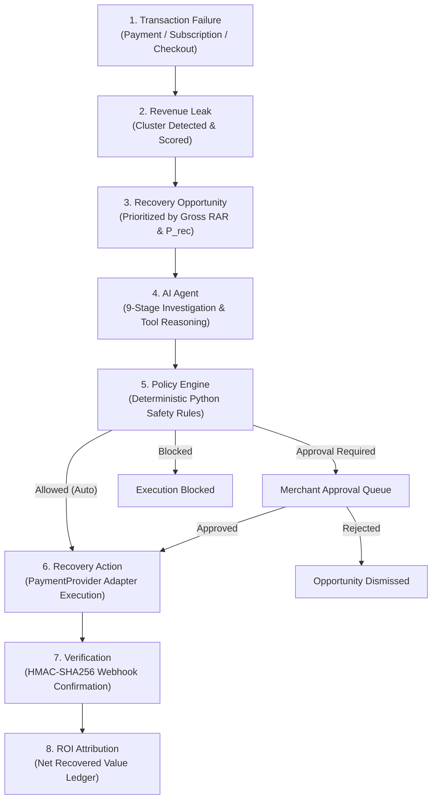
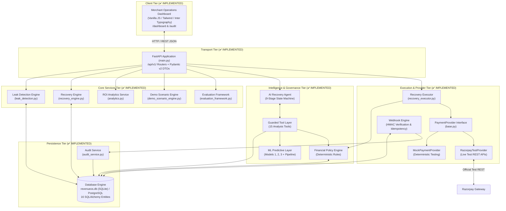

# RevenueOS — System Architecture

## 1. Project Overview

**RevenueOS** is an autonomous, auditable, policy-bounded revenue recovery intelligence platform designed for merchants in the Razorpay payment ecosystem. It continuously monitors payment transaction streams, detects systemic and incidental payment failures, isolates revenue leakages, synthesizes diagnostic evidence using an AI agent, bounds all actions through a deterministic rule engine, executes recovery procedures via provider adapters, verifies settled funds via signature-verified webhooks, and attributes net-recovered revenue to an audit-grade ROI ledger.

---

## 2. Business Problem & Objectives

### The Business Problem
Modern Indian e-commerce merchants lose **12% to 28% of transaction volume** to addressable checkout and payment drop-offs:
1. **Transient Gateway Degredations**: Bank downtimes and routing degradation cause temporary failure spikes (e.g. HDFC UPI timeouts) that could be recovered via alternate payment routes or payment links.
2. **Checkout Drop-offs & Cart Abandonment**: Customers drop off during OTP verification or payment method selection with zero automated re-engagement.
3. **Subscription Mandate Failures**: Recurring auto-debit payments fail due to expired cards or temporary balance limits without intelligent dunning retries.
4. **Lack of Auditable AI Safety**: Merchants hesitate to adopt autonomous AI recovery solutions due to fears of double-billing, customer spam, policy violations, or hallucinated actions.

### Project Objectives
- **Automate Failure Recovery**: Systematically identify high-probability recoverable failures and trigger safe interventions.
- **Ensure Bounded AI Safety**: Guarantee that AI reasoning is strictly cognitive and gated behind a deterministic policy engine with hard amount caps.
- **Provide Complete Traceability**: Maintain an immutable audit ledger linking every recovered rupee to an explicit failure, decision, and webhook receipt.
- **Quantify Business ROI**: Prove financial lift through transparent Before vs. After RevenueOS telemetry without fabricated metrics.

---

## 3. Current Implementation Status Overview

| Component | Status | Implementation Details |
|---|---|---|
| **Merchant Operations UI** | ✅ IMPLEMENTED | Production-grade Vanilla JS & CSS dashboard served at `/dashboard` and `/audit` covering all 8 operational pages. |
| **Next.js 14+ Client Shell** | 🔵 PLANNED | Alternative React/Next.js client tier (currently implemented via FastAPI static templates). |
| **FastAPI Backend Gateway** | ✅ IMPLEMENTED | Asynchronous REST backend in `backend/app/main.py` with 17 v1 routers, CORS, and Pydantic v2 schemas. |
| **Relational Database** | ✅ IMPLEMENTED | 16 SQLAlchemy models in `backend/app/models/` backed by SQLite (`revenueos.db`) and PostgreSQL compatible. |
| **Leak Detection Engine** | ✅ IMPLEMENTED | `app/services/leak_detection.py` detecting payment failures, checkout abandonment, and subscription anomalies. |
| **AI Recovery Agent** | ✅ IMPLEMENTED | `app/services/agent/recovery_agent.py` running a 9-stage state machine with 15 guarded tools. |
| **ML Predictive Models** | ✅ IMPLEMENTED | `app/ml/models.py` implementing Models 1, 2, and 3 with scikit-learn pipelines, offline registry, and evaluation reports. |
| **Policy Engine** | ✅ IMPLEMENTED | `app/services/policy_engine.py` evaluating actions against ₹15k approval gates, cooldowns, and retry limits. |
| **Payment Provider Abstraction** | ✅ IMPLEMENTED | `PaymentProvider` ABC supporting `MockPaymentProvider` and `RazorpayTestProvider` with live test mode safety checks. |
| **Webhook Processing Engine** | ✅ IMPLEMENTED | `app/services/webhook_engine.py` with HMAC-SHA256 verification, unique event deduplication, and state reconciliation. |
| **Audit Ledger & Timeline** | ✅ IMPLEMENTED | Append-only `audit_events` logging causality chains with automatic secret scrubbing and UI timeline. |
| **Security Controls** | ✅ IMPLEMENTED | Prompt injection regex blocker, tool allowlist, parameter validation, and tenant isolation. |
| **Multi-Tenant JWT Auth** | 🔵 PLANNED | Production enterprise authentication (currently operates with merchant ID query/dependency context). |
| **Distributed Task Queue** | 🔵 PLANNED | Celery/Redis background worker queue for high-volume asynchronous webhook bursts. |

---

## 4. End-to-End Recovery Lifecycle

The core operational lifecycle of RevenueOS follows an eight-stage causal progression:

1. **Transaction Event**: Failed payment attempts, abandoned checkout sessions, or missed subscription mandates are ingested.
2. **Revenue Leak**: Telemetry engines cluster correlated failures into high-level leaks (e.g. gateway timeout surges).
3. **Recovery Opportunity**: Granular recoverable opportunities are generated and prioritized by Expected Recovered Value ($\text{ERV} = \text{Amount} \times P_{\text{rec}}$).
4. **AI Agent**: State machine gathers telemetry, isolates root cause, queries ML predictions, and selects an intervention.
5. **Policy Engine**: Deterministic rules evaluate the proposed action against financial limits, cooldowns, and merchant policies.
6. **Recovery Action**: Authorized actions (retries, payment links, dunning notifications) are executed via provider adapters.
7. **Verification**: Inbound webhooks verify payment capture and reconcile the opportunity to `RECOVERED`.
8. **ROI**: Actual recovered amounts update merchant financial metrics and before/after lift analyses.

---

## 5. System Architecture & Component Interactions

---

## 6. Subsystem Architectures

### 6.1 Frontend Architecture
* **Implementation Status:** ✅ IMPLEMENTED
* **Location:** `backend/app/static/dashboard.html` (93 KB), `backend/app/static/audit.html` (25 KB).
* **Serving:** Embedded within FastAPI via `app.add_api_route("/dashboard", serve_dashboard)`.
* **Pages Implemented:**
  1. **Overview**: Real-time revenue processed, revenue at risk, recoverable revenue, recovered revenue, recovery rate, and trend charts.
  2. **Revenue Leaks**: Categorized leak cards, severity ratings, gross amounts at risk, root cause candidates, and recommended actions.
  3. **Recovery Opportunities**: Interactive priority queue data table, customer tags, recovery probabilities, action triggers, and slide-over investigation drawers.
  4. **AI Agent Console**: Conversational investigation interface, root cause diagnostics, and chronological 9-stage telemetry execution logs.
  5. **Transactions**: Transaction registry with status filters and detailed payment attempt histories.
  6. **Recovery Actions**: Execution management dashboard with merchant approval buttons and retry actions.
  7. **Audit Trail**: Append-only event log with event type filters and causality chain viewer.
  8. **ROI Analytics**: Before vs. After RevenueOS comparison, lift metrics, automation rates, and financial ROI.
* **Planned Client Tier:** 🔵 PLANNED Next.js 14+ App Router client with TanStack Query and Zustand for multi-tenant SaaS deployment.

### 6.2 Backend Architecture
* **Implementation Status:** ✅ IMPLEMENTED
* **Location:** `backend/app/`
* **Structure:**
  - `main.py`: Application factory, CORS middleware, lifespan schema initialization, router mounting.
  - `api/v1/`: 17 modular routers handling resources (`merchants`, `transactions`, `subscriptions`, `leaks`, `opportunities`, `agent`, `policy`, `webhooks`, `recovery`, `audit`, `analytics`, `ml`, `evaluation`, `security_audit`, `demo`).
  - `schemas/`: Pydantic models for request validation and response serialization.
  - `config.py`: Environment-driven configuration using `pydantic-settings`.
  - `security.py`: Centralized security controls.

### 6.3 Database Architecture
* **Implementation Status:** ✅ IMPLEMENTED
* **Location:** `backend/app/models/`, `backend/app/db/`
* **Active Database:** `revenueos.db` (SQLite 3.x with WAL mode and Decimal JSON serialization).
* **ORM:** SQLAlchemy 2.0 with DeclarativeBase, `UUIDPrimaryKeyMixin`, `TimestampMixin`.
* **Models (16 Entities):** `Merchant`, `Customer`, `Payment`, `PaymentAttempt`, `Subscription`, `SubscriptionAttempt`, `CheckoutSession`, `RevenueLeak`, `RecoveryOpportunity`, `RecoveryAction`, `AgentDecision`, `PolicyDecision`, `AuditEvent`, `WebhookEvent`, `Experiment`, `ModelPrediction`.

### 6.4 AI Agent Architecture
* **Implementation Status:** ✅ IMPLEMENTED
* **Location:** `backend/app/services/agent/`
* **Execution Model:** 9-stage deterministic state machine (`recovery_agent.py`):
  `OBSERVE` → `INVESTIGATE` → `DIAGNOSE` → `QUANTIFY` → `RECOMMEND` → `POLICY_CHECK` → `EXECUTE_OR_APPROVE` → `VERIFY` → `REPORT`.
* **Guardrails:** AI reasoning has zero direct database mutation privileges. All financial actions are structurally checked by `FinancialActionPolicyEngine`.
* **Tool Layer:** 15 typed tools in `tools.py` for transaction history, telemetry, failure analysis, and ML inference.

### 6.5 ML Architecture
* **Implementation Status:** ✅ IMPLEMENTED
* **Location:** `backend/app/ml/`
* **Pipeline:** `pipeline.py` (`PaymentFeatureExtractor`) extracts 10 features (log amount, attempt count, customer LTV, error code category, temporal factors).
* **Models Implemented (`models.py`):**
  1. `PaymentRecoveryModel`: LogisticRegression baseline vs HistGradientBoostingClassifier.
  2. `RouteAnomalyDetector`: IsolationForest multivariate anomaly detection.
  3. `RecoveryPriorityRegressor`: Regressor estimating calibrated recovery probabilities.
* **Model Registry:** Artifacts persisted in `backend/app/ml/artifacts/`.

### 6.6 Policy Engine Architecture
* **Implementation Status:** ✅ IMPLEMENTED
* **Location:** `backend/app/services/policy_engine.py`
* **Design:** Deterministic Python logic without LLM hallucination risk.
* **Enforced Guardrails:**
  - High-Value Guard: Amounts $> \text{₹}15,000$ strictly require human merchant approval.
  - Maximum Cap: Actions exceeding $\text{₹}5,00,000$ are unconditionally blocked.
  - Retry Limit: Maximum 3 attempts per 24 hours.
  - Cooldown: 4-hour cooldown period between recovery attempts.
  - Confidence Floor: Minimum 60% ML recovery probability required for automated execution.

### 6.7 Razorpay Integration Architecture
* **Implementation Status:** ✅ IMPLEMENTED
* **Location:** `backend/app/services/payment_provider/`
* **Interfaces:**
  - `PaymentProvider` (ABC in `base.py`).
  - `MockPaymentProvider` (`mock_provider.py`): In-memory deterministic testing.
  - `RazorpayTestProvider` (`razorpay_provider.py`): Official REST API integration for test mode.
  - `PaymentProviderRegistry` (`registry.py`): Dynamic switching with automatic mock fallback.
* **Safety Constraint:** Rejects any live mode credentials (`rzp_live_...`).

### 6.8 Webhook Architecture
* **Implementation Status:** ✅ IMPLEMENTED
* **Location:** `backend/app/services/webhook_engine.py`
* **Pipeline:**
  1. Signature verification using HMAC-SHA256 via `X-Razorpay-Signature`.
  2. Idempotency deduplication on `webhook_events.event_id`.
  3. State transition updates (`payment.captured` $\to$ `SUCCESS`, `payment.failed` $\to$ `FAILED`).
  4. Automatic reconciliation of `RecoveryOpportunity` to `RECOVERED` with `actual_recovered_value`.
  5. Write immutable `AuditEvent`.

### 6.9 Audit System Architecture
* **Implementation Status:** ✅ IMPLEMENTED
* **Location:** `backend/app/services/audit_service.py`, `backend/app/models/audit_event.py`
* **Ledger:** Append-only table recording causality chains:
  $$\text{request\_id} \longrightarrow \text{leak\_id} \longrightarrow \text{opportunity\_id} \longrightarrow \text{agent\_decision\_id} \longrightarrow \text{policy\_decision\_id} \longrightarrow \text{action\_id} \longrightarrow \text{webhook\_event\_id}$$
* **Sanitization:** Automatically redacts API keys, secrets, and auth tokens.

### 6.10 Security Boundaries
* **Implementation Status:** ✅ IMPLEMENTED
* **Location:** `backend/app/security.py`
* **Controls:** 13 prompt injection regex detection patterns, agent tool allowlist, parameterized SQLAlchemy queries, tenant isolation via `merchant_id`, and secret isolation in backend `.env`.

---

## 7. Future & Planned Components

1. **Distributed Asynchronous Task Execution (🔵 PLANNED)**:
   - Integration with Celery or Temporal for asynchronous webhook bursts and long-running dunning retry workflows.
2. **Enterprise Multi-Tenant Authentication (🔵 PLANNED)**:
   - OAuth2 / JWT authentication with role-based access control (CFO, PayOps, Developer roles).
3. **PostgreSQL Production Sharding (🔵 PLANNED)**:
   - Horizontal partitioning on transaction and audit tables for merchants processing $>1\text{M}$ transactions daily.
4. **Online Multi-Armed Bandits for Payment Routing (🔵 PLANNED)**:
   - Dynamic reinforcement learning for optimal gateway routing during active bank degradation events.
