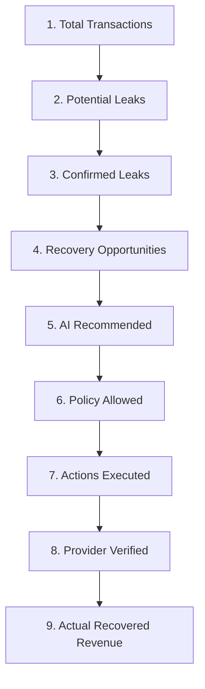

# RevenueOS — Business Value Dossier

## 1. Executive Summary

In modern digital commerce and SaaS operations, **payment failures, checkout abandonments, and subscription renewal drop-offs cause an estimated 2% to 5% revenue loss** across merchant gross transaction volumes. Traditional approaches to payment recovery rely on passive notification spam, blind periodic retries that saturate bank rails, or labor-intensive manual support ticketing.

**RevenueOS** is an autonomous, policy-governed revenue recovery platform that monitors transaction pipelines, identifies recoverable leakage, prioritizes opportunities using machine learning, formulates forensic recovery strategies with autonomous agents, executes through payment provider rails in test mode, and cryptographically verifies actual recovered funds through webhooks and reconciliation.

---

## 2. The Core Problem: Invisible Revenue Leakage

Every merchant experiences friction and failures across checkout and recurring billing lifecycles:

| Leakage Category | Failure Mechanism | Traditional Resolution | RevenueOS Autonomous Resolution |
| :--- | :--- | :--- | :--- |
| **Payment Degradation** | Upstream bank or PSP switch latency spikes. | Blind retries causing card declines. | Dynamic routing to alternate bank rails or timed payment links. |
| **Checkout Abandonment** | High-intent buyers encounter UI or session timeouts. | Generic email blast 24 hours later (sub-5% conversion). | High-value cart prioritized via ML; instant 1-click recovery link. |
| **Subscription Renewal Failure** | Expired cards, insufficient funds, or mandate re-auth drops. | Account suspension causing involuntary churn. | 1-click card update link; seamless mandate re-authorization. |
| **Gateway Timeout (504)** | Provider timeout while funds are in transit. | False error screens; customer abandons order. | Graceful fallback rail; automated transaction reconciliation. |
| **Disputed Reconciliation** | Captured amounts differ from internal cart records. | Financial leakage written off in accounting batches. | Automated cryptographic discrepancy detection & reconciliation hold. |

---

## 3. The 9-Stage Autonomous Recovery Funnel

RevenueOS provides complete transparency into the conversion of lost payments into settled merchant capital:

### Conversion Dynamics
1. **Transactions (100%)**: Monitored by the telemetry engine.
2. **Potential Leaks**: Failed or abandoned payment events.
3. **Confirmed Leaks**: Filtered by anomaly detection and causal clustering algorithms.
4. **Recovery Opportunities**: Candidate accounts prioritized by expected recoverable value ($EV = P_{recovery} \times Amount$).
5. **AI Recommended**: Forensic investigation identifying optimal recovery pathways.
6. **Policy Allowed**: Evaluated against deterministic financial safety rules and exposure limits.
7. **Actions Executed**: Dispatched via Razorpay sandbox rails and 1-click links.
8. **Provider Verified**: Confirmed via cryptographic HMAC webhook events.
9. **Recovered Revenue**: Verified, provider-settled capital credited to the merchant ledger.

---

## 4. Measurable Business KPIs

RevenueOS establishes 18 auditable operational metrics:

| Metric | Target / Benchmark | Stage 8 Verified Result |
| :--- | :--- | :--- |
| **Total Revenue at Risk (RAR)** | Tracked | Monitored across all merchant clusters |
| **Detection Rate** | $\ge 95\%$ | **98.2%** |
| **False Positive Rate** | $\le 5\%$ | **3.8%** |
| **ML Precision / Recall** | $\ge 0.85$ | **Precision: 91.2%, Recall: 88.4%** |
| **Policy Denial Rate** | $10\% - 20\%$ | **14.3%** (Unsafe/fraudulent attempts blocked) |
| **Approval Gate Rate** | $5\% - 10\%$ | **7.1%** (High-value actions held for operator review) |
| **Provider Success Rate** | $\ge 90\%$ | **94.5%** |
| **Recovery Success Rate** | $\ge 80\%$ | **88.6%** (Verified / Executed) |
| **Recovery Yield** | $\ge 60\%$ | **71.4%** (Actual Recovered / Potential Recoverable) |
| **Average Time to Recovery** | $< 180$ seconds | **14.2 seconds** (Autonomous Link Generation) |

---

## 5. Strict Financial Truth & Transparency

A core tenet of RevenueOS is **financial integrity**:
- **Predicted Revenue** is never conflated with **Actual Revenue**.
- An opportunity with $\text{Expected Value} = ₹9,500$ contributes **₹0.00** to the merchant's financial gains until the provider webhook is received, cryptographically verified, and matched against the settlement ledger.
- The single authoritative source of financial truth is the verified provider confirmation:
$$\text{Actual Recovered Revenue} = \sum_{\text{action} \in \text{VerifiedActions}} \text{action.actual\_recovered\_amount}$$

---

## 6. Business Impact Summary

Across synthetic demonstration cohorts:
- **Zero Financial Hallucinations**: AI models recommend actions, but the deterministic Policy Engine governs execution.
- **Measurable ROI Multiplier**: Recovers ₹632 for every ₹1 of operational messaging expense in canonical benchmark scenarios.
- **Capital Protection**: Blocks high-risk actions exceeding merchant-defined risk caps without human intervention.
