# RevenueOS — Database Architecture & Data Models

This document details the actual database architecture and SQLAlchemy data models implemented in `backend/app/models/` and configured in `backend/app/db/`.

---

## 1. Database Configuration & Engine Setup

* **Active Database:** SQLite 3 (`revenueos.db`, ~2 MB seeded state), operating in WAL mode with multithreaded connection pooling.
* **Production Capability:** Fully compatible with PostgreSQL (tested with standard SQLAlchemy 2.0 types and numeric precision).
* **Configuration Module:** `backend/app/db/session.py` and `backend/app/config.py`:
  - `DATABASE_URL`: Defaults to `sqlite:///./revenueos.db` (can be overridden to `postgresql+psycopg2://...`).
  - `custom_json_serializer`: Serializes `Decimal` and `datetime` safely for JSONB and JSON columns.
  - Session lifecycle managed via FastAPI `get_db()` dependency generator with automatic rollback on unhandled exceptions and session closure.
* **Base Mixins (`backend/app/db/base.py`):**
  - `Base`: SQLAlchemy `DeclarativeBase`.
  - `UUIDPrimaryKeyMixin`: UUIDv4 primary keys (`id: Mapped[uuid.UUID] = mapped_column(Uuid(as_uuid=True), primary_key=True, default=uuid.uuid4)`).
  - `TimestampMixin`: Automatic UTC timezone-aware timestamps (`created_at: Mapped[datetime] = mapped_column(DateTime(timezone=True), default=get_utc_now, index=True)`).
  - Monetary Precision: Standardized financial quantizing via `quantize_inr()` using `NUMERIC(14, 2)`.

---

## 2. Entity-Relationship Diagram (Actual Models)

```mermaid
erDiagram
    merchants ||--o{ customers : owns
    merchants ||--o{ payments : processes
    merchants ||--o{ subscriptions : manages
    merchants ||--o{ checkout_sessions : tracks
    merchants ||--o{ revenue_leaks : detects
    merchants ||--o{ recovery_opportunities : owns
    merchants ||--o{ audit_events : logs

    customers ||--o{ payments : makes
    customers ||--o{ subscriptions : holds
    customers ||--o{ checkout_sessions : initiates
    customers ||--o{ recovery_opportunities : relates_to

    payments ||--o{ payment_attempts : logs
    subscriptions ||--o{ subscription_attempts : logs

    revenue_leaks ||--o{ recovery_opportunities : spawns
    recovery_opportunities ||--o{ agent_decisions : analyzes
    recovery_opportunities ||--o{ policy_decisions : evaluates
    recovery_opportunities ||--o{ recovery_actions : triggers

    agent_decisions ||--o{ policy_decisions : gates
    policy_decisions ||--o{ recovery_actions : authorizes

    merchants {
        uuid id PK
        string name
        string email
        json settings_json
        datetime created_at
    }

    customers {
        uuid id PK
        uuid merchant_id FK
        string external_ref
        string risk_segment
        numeric lifetime_value
        boolean is_vip
        datetime created_at
    }

    payments {
        uuid id PK
        uuid merchant_id FK
        uuid customer_id FK
        numeric amount
        string currency
        string status
        string payment_method
        string bank
        string device_type
        string route
        datetime created_at
    }

    payment_attempts {
        uuid id PK
        uuid payment_id FK
        int attempt_number
        string status
        string failure_reason
        string error_code
        datetime attempted_at
    }

    subscriptions {
        uuid id PK
        uuid merchant_id FK
        uuid customer_id FK
        numeric plan_amount
        string billing_cycle
        string status
        datetime created_at
    }

    subscription_attempts {
        uuid id PK
        uuid subscription_id FK
        int attempt_number
        string status
        string failure_reason
        datetime attempted_at
    }

    checkout_sessions {
        uuid id PK
        uuid merchant_id FK
        uuid customer_id FK
        numeric cart_value
        string status
        string stage_dropped
        datetime created_at
    }

    revenue_leaks {
        uuid id PK
        uuid merchant_id FK
        string leak_type
        string pattern_description
        numeric affected_amount
        numeric revenue_at_risk
        string severity
        numeric severity_score
        numeric confidence
        string status
        json root_cause_candidates
        json evidence
        datetime detection_window_start
        datetime detection_window_end
        datetime created_at
    }

    recovery_opportunities {
        uuid id PK
        uuid revenue_leak_id FK
        uuid merchant_id FK
        uuid customer_id FK
        uuid payment_id FK
        numeric gross_value_affected
        numeric potentially_recoverable_value
        numeric recovery_probability
        numeric expected_recovered_value
        numeric actual_recovered_value
        string status
        string priority
        numeric priority_score
        string risk
        datetime created_at
        datetime updated_at
    }

    agent_decisions {
        uuid id PK
        uuid opportunity_id FK
        text problem
        json evidence_json
        numeric estimated_impact
        numeric recovery_probability
        string recommended_action
        text reason
        string risk_level
        numeric expected_recovery
        numeric actual_recovery
        string currency
        datetime created_at
    }

    policy_decisions {
        uuid id PK
        uuid agent_decision_id FK
        uuid opportunity_id FK
        string action_type
        boolean allowed
        boolean approval_required
        string risk_level
        numeric max_amount_allowed
        int retry_limit
        int cooldown_seconds
        numeric confidence_threshold
        json limits_json
        text decision_reason
        datetime created_at
    }

    recovery_actions {
        uuid id PK
        uuid opportunity_id FK
        uuid policy_decision_id FK
        string action_type
        numeric amount
        string currency
        string status
        text reason
        string predicted_outcome
        json execution_result
        datetime created_at
        datetime executed_at
    }

    audit_events {
        uuid id PK
        uuid merchant_id FK
        string actor
        string event_type
        string related_entity_type
        uuid related_entity_id
        uuid transaction_id
        uuid opportunity_id
        uuid action_id
        uuid agent_decision_id
        uuid policy_decision_id
        string status
        text summary
        text message
        json metadata_json
        string request_id
        datetime created_at
    }

    webhook_events {
        uuid id PK
        string provider
        string event_id UK
        string event_type
        json raw_payload_json
        boolean signature_verified
        boolean processed
        datetime received_at
        datetime processed_at
    }

    experiments {
        uuid id PK
        string name
        text hypothesis
        string scenario
        datetime started_at
        datetime ended_at
        text result_summary
        datetime created_at
    }

    model_predictions {
        uuid id PK
        string model_name
        string model_version
        string entity_type
        uuid entity_id
        json input_features_json
        numeric prediction
        numeric confidence
        datetime created_at
    }
```

---

## 3. Detailed Model Specifications (16 Implemented Entities)

### 3.1 `Merchant` (`merchant.py`)
* **Purpose:** Represents the merchant organization context.
* **Fields:** `id` (UUID PK), `name` (String 100), `email` (String 255), `created_at` (Timestamp), `settings_json` (JSON).
* **Relationships:** One-to-many with `payments`, `subscriptions`, `checkout_sessions`, `revenue_leaks`, `customers`.
* **Indexes:** `ix_merchants_email` (unique).

### 3.2 `Customer` (`customer.py`)
* **Purpose:** Represents a synthetic buyer/payer profile (no real PII).
* **Fields:** `id` (UUID PK), `merchant_id` (UUID FK), `external_ref` (String 100, masked ID), `risk_segment` (Enum: low/medium/high), `lifetime_value` (Numeric 14,2), `is_vip` (Boolean), `created_at` (Timestamp).
* **Relationships:** Belongs to `Merchant`; has many `payments`, `subscriptions`, `checkout_sessions`.
* **Indexes:** `ix_customers_merchant_id`, `ix_customers_external_ref`.

### 3.3 `Payment` (`payment.py`)
* **Purpose:** Represents a payment transaction attempt lifecycle.
* **Fields:** `id` (UUID PK), `merchant_id` (UUID FK), `customer_id` (UUID FK), `amount` (Numeric 14,2), `currency` (String 3, 'INR'), `status` (Enum: pending/success/failed/recovered), `payment_method` (String 30), `bank` (String 30, nullable), `device_type` (String 30), `route` (String 50), `created_at` (Timestamp).
* **Relationships:** Has many `payment_attempts`.
* **Indexes:** `ix_payments_merchant_status`, `ix_payments_merchant_created_at`.

### 3.4 `PaymentAttempt` (`payment_attempt.py`)
* **Purpose:** Granular log of each routing/gateway attempt for a payment.
* **Fields:** `id` (UUID PK), `payment_id` (UUID FK), `attempt_number` (Integer), `status` (String 20), `failure_reason` (String 255), `error_code` (String 50), `attempted_at` (Timestamp).
* **Relationships:** Belongs to `Payment`.

### 3.5 `Subscription` (`subscription.py`)
* **Purpose:** Recurring billing mandate tracking.
* **Fields:** `id` (UUID PK), `merchant_id` (UUID FK), `customer_id` (UUID FK), `plan_amount` (Numeric 14,2), `billing_cycle` (String 20), `status` (Enum: active/paused/failed/cancelled), `created_at` (Timestamp).
* **Relationships:** Has many `subscription_attempts`.

### 3.6 `SubscriptionAttempt` (`subscription_attempt.py`)
* **Purpose:** Recurring auto-debit charge attempt history.
* **Fields:** `id` (UUID PK), `subscription_id` (UUID FK), `attempt_number` (Integer), `status` (String 20), `failure_reason` (String 255), `attempted_at` (Timestamp).

### 3.7 `CheckoutSession` (`checkout_session.py`)
* **Purpose:** Tracks buyer checkout sessions and funnel drop-off stages.
* **Fields:** `id` (UUID PK), `merchant_id` (UUID FK), `customer_id` (UUID FK, nullable), `cart_value` (Numeric 14,2), `status` (Enum: completed/abandoned), `stage_dropped` (String 50), `created_at` (Timestamp).

### 3.8 `RevenueLeak` (`revenue_leak.py`)
* **Purpose:** High-level clustered pattern of revenue loss (gateway spikes, checkout drops).
* **Fields:** `id` (UUID PK), `merchant_id` (UUID FK), `leak_type` (Enum), `pattern_description` (Text), `affected_amount` (Numeric 14,2), `revenue_at_risk` (Numeric 14,2), `affected_transactions` (Integer), `confidence` (Numeric 5,4), `severity` (String 20), `severity_score` (Numeric 5,2), `status` (String 30), `root_cause_candidates` (JSON), `evidence` (JSON), `detection_window_start`, `detection_window_end`, `created_at`.
* **Relationships:** Has many `recovery_opportunities`.

### 3.9 `RecoveryOpportunity` (`recovery_opportunity.py`)
* **Purpose:** Granular actionable opportunity prioritized in the merchant priority queue.
* **Fields:** `id` (UUID PK), `revenue_leak_id` (UUID FK, nullable), `merchant_id` (UUID FK), `customer_id` (UUID FK, nullable), `payment_id` (UUID FK, nullable), `gross_value_affected` (Numeric 14,2), `potentially_recoverable_value` (Numeric 14,2), `recovery_probability` (Numeric 5,4), `expected_recovered_value` (Numeric 14,2), `actual_recovered_value` (Numeric 14,2, nullable), `currency` (String 3), `status` (Enum), `priority` (String 20), `priority_score` (Numeric 5,2), `risk` (String 20), `failure_reason` (String 255), `created_at`, `updated_at`.
* **Relationships:** Has many `agent_decisions`, `recovery_actions`.

### 3.10 `AgentDecision` (`agent_decision.py`)
* **Purpose:** Persisted diagnosis, evidence synthesis, and action recommendation by the AI agent.
* **Fields:** `id` (UUID PK), `opportunity_id` (UUID FK), `problem` (Text), `evidence_json` (JSON), `estimated_impact` (Numeric 14,2), `recovery_probability` (Numeric 5,4), `recommended_action` (String 255), `reason` (Text), `risk_level` (String 20), `expected_recovery` (Numeric 14,2), `actual_recovery` (Numeric 14,2), `currency` (String 3), `created_at`.

### 3.11 `PolicyDecision` (`policy_decision.py`)
* **Purpose:** Deterministic policy gate outcome authorizing or restricting proposed financial action.
* **Fields:** `id` (UUID PK), `agent_decision_id` (UUID FK, nullable), `opportunity_id` (UUID FK, nullable), `action_type` (String 50), `allowed` (Boolean), `approval_required` (Boolean), `risk_level` (String 20), `max_amount_allowed` (Numeric 14,2), `retry_limit` (Integer), `cooldown_seconds` (Integer), `confidence_threshold` (Numeric 5,4), `limits_json` (JSON), `decision_reason` (Text), `created_at`.

### 3.12 `RecoveryAction` (`recovery_action.py`)
* **Purpose:** Concrete execution record of an authorized recovery procedure.
* **Fields:** `id` (UUID PK), `opportunity_id` (UUID FK), `policy_decision_id` (UUID FK, nullable), `action_type` (Enum), `amount` (Numeric 14,2), `currency` (String 3), `status` (Enum: proposed/approved/executing/success/failed/blocked), `reason` (Text), `predicted_outcome` (String 255), `execution_result` (JSON), `created_at`, `executed_at`.

### 3.13 `AuditEvent` (`audit_event.py`)
* **Purpose:** Append-only immutable causality log of every critical system transition.
* **Fields:** `id` (UUID PK), `merchant_id` (UUID FK), `actor` (String 50), `event_type` (String 50), `related_entity_type` (String 50), `related_entity_id` (UUID), `transaction_id` (UUID, nullable), `opportunity_id` (UUID, nullable), `action_id` (UUID, nullable), `agent_decision_id` (UUID, nullable), `policy_decision_id` (UUID, nullable), `status` (String 20), `summary` (Text), `message` (Text), `metadata_json` (JSON), `request_id` (String 100), `created_at`.

### 3.14 `WebhookEvent` (`webhook_event.py`)
* **Purpose:** Inbound webhook receipt and idempotency record.
* **Fields:** `id` (UUID PK), `provider` (String 30), `event_id` (String 100, unique constraint), `event_type` (String 100), `raw_payload_json` (JSON), `signature_verified` (Boolean), `processed` (Boolean), `received_at`, `processed_at`.

### 3.15 `Experiment` (`experiment.py`)
* **Purpose:** Records A/B test simulations and recovery scenarios.
* **Fields:** `id` (UUID PK), `name` (String 100), `hypothesis` (Text), `scenario` (String 50), `started_at`, `ended_at`, `result_summary` (Text), `created_at`.

### 3.16 `ModelPrediction` (`model_prediction.py`)
* **Purpose:** Audit log of ML model inferences.
* **Fields:** `id` (UUID PK), `model_name` (String 100), `model_version` (String 50), `entity_type` (String 50), `entity_id` (UUID), `input_features_json` (JSON), `prediction` (Numeric 14,4), `confidence` (Numeric 5,4), `created_at`.

---

## 4. Implemented vs Planned Schema

| Schema Component | Status | Location / Notes |
|---|---|---|
| **Core Relational Schema (16 Entities)** | ✅ IMPLEMENTED | All 16 models in `backend/app/models/` with foreign keys, mixins, and indices. |
| **Idempotency Deduplication Key** | ✅ IMPLEMENTED | Unique index on `webhook_events.event_id` preventing duplicate webhook mutations. |
| **Immutable Audit Logging** | ✅ IMPLEMENTED | Write-only `audit_events` with full relational causality pointers. |
| **Paise & Monetary Quantization** | ✅ IMPLEMENTED | `NUMERIC(14,2)` precision applied to all financial values. |
| **PostgreSQL Partitioning** | 🔵 PLANNED | Monthly range-partitioning on `payments` and `audit_events` tables for high-volume enterprise throughput. |
| **Distributed Cache / Read Replicas** | 🔵 PLANNED | Redis caching layer for merchant overview KPI aggregations. |
