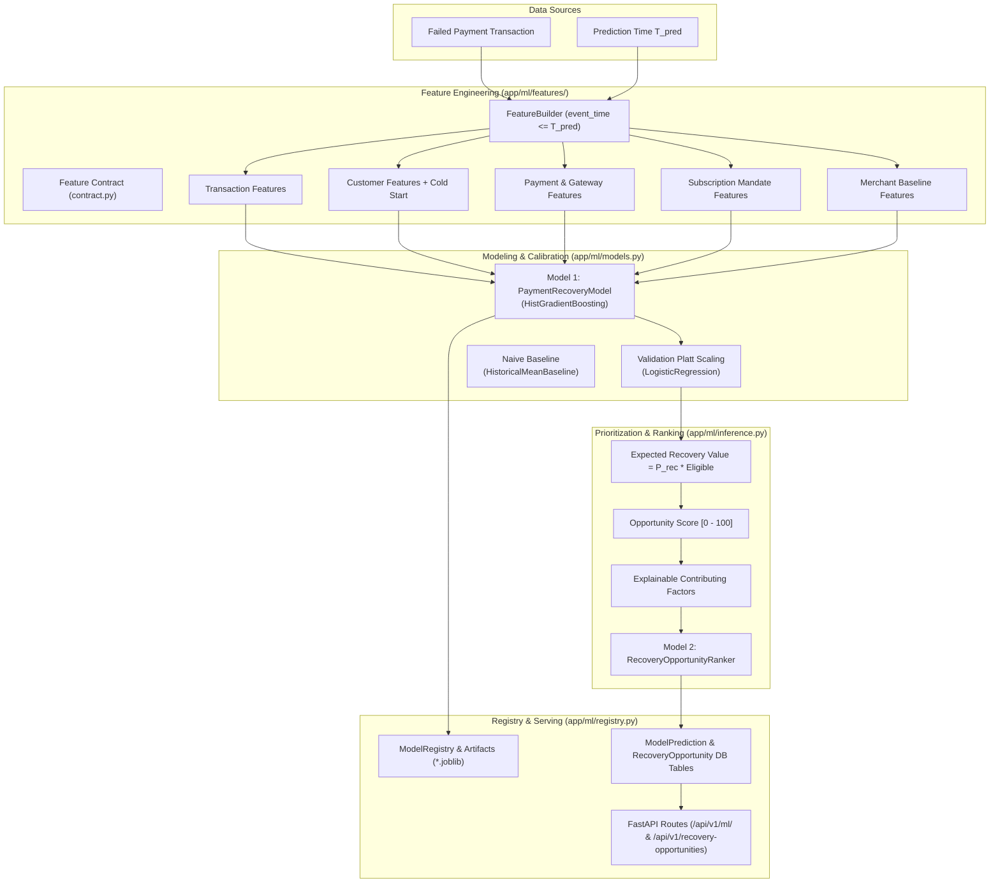

# RevenueOS — Machine Learning Pipeline & Recovery Intelligence (Stage 4)

This document details the machine learning architecture, feature engineering pipelines, model training code, evaluation metrics, and inference services implemented in `backend/app/ml/`.

---

## 1. Machine Learning Architecture Overview

* **Implementation Status:** ✅ STAGE 4 COMPLETE
* **Location:** `backend/app/ml/`
* **Core Philosophy:** Every recovery recommendation must be grounded in calibrated predictive probabilities rather than arbitrary heuristics. ML predictions are logged to the `model_predictions` audit table to provide full explainability.
* **CRITICAL ARCHITECTURAL BOUNDARY:**
  > **ML IS ADVISORY. ML DOES NOT HAVE AUTHORITY TO EXECUTE FINANCIAL ACTIONS.**
  > The architecture strictly enforces:
  > $$\text{Revenue Leak} \to \text{Candidate Transactions} \to \text{Feature Engineering} \to \text{Recovery Probability Model} \to \text{Opportunity Ranking} \to \text{Recovery Opportunity} \to \text{Policy Engine} \to \text{Decision}$$
  > The ML layer **MUST NOT**: call Razorpay, execute payments, retry payments, issue refunds, send customer communications, modify financial state directly, or make authorization decisions.



---

## 2. Feature Engineering Pipeline & Contract (`app/ml/features/`)

Feature extraction is centralized in `FeatureBuilder`, enforcing point-in-time temporal boundaries ($T_{\text{pred}}$) and formal feature definitions.

### Formal Feature Contract (29 Point-in-Time Features)
1. **Transaction Features (`transaction_features.py`):**
   - `transaction_amount`, `log_amount`, `amount_percentile_for_merchant`, `payment_method`, `transaction_hour`, `transaction_day_of_week`, `days_since_transaction`, `attempt_number`, `time_since_previous_attempt`.
2. **Customer Features (`customer_features.py`):**
   - `customer_transaction_count_before_prediction`, `customer_success_count`, `customer_failure_count`, `customer_historical_success_rate`, `customer_historical_failure_rate`, `customer_lifetime_value_before_prediction`, `days_since_last_success`, `days_since_last_transaction`, `is_cold_start`.
3. **Payment & Gateway Features (`payment_features.py`):**
   - `failure_reason` (categorized: `TIMEOUT`, `INSUFFICIENT_FUNDS`, `LIMIT_EXCEEDED`, `AUTH_FAILURE`, `OTHER`, `UNKNOWN`), `bank` (`HDFC`, `ICICI`, `SBI`, `AXIS`, `KOTAK`, `OTHER`), `device_type`, `previous_payment_method_success_rate`, `previous_attempt_count`, `time_since_failure`.
4. **Subscription Features (`subscription_features.py`):**
   - `is_subscription`, `subscription_age_days`, `renewal_number`, `previous_renewal_count`, `previous_renewal_success_rate`, `plan_value`, `subscription_status`.
5. **Merchant Baseline Features (`merchant_features.py`):**
   - `merchant_payment_success_rate`, `merchant_failure_rate`, `merchant_average_transaction_value`, `merchant_payment_method_success_rate` (strictly calculated using historical records prior to $T_{\text{pred}}$).

### Data Leakage Prevention
* Every query enforces `event_time <= prediction_time`.
* Ground truth scenario labels from Stage 2 are strictly restricted to offline evaluation.

---

## 3. Implemented Models (`app/ml/models.py`)

### Model 1 — Payment Recovery Probability Classifier (`PaymentRecoveryModel`)
* **Purpose:** Predicts point-in-time recovery likelihood $P(\text{recovery} \mid \text{features at } T_{\text{pred}}) \in [0.0, 1.0]$.
* **Algorithm:** `HistGradientBoostingClassifier(max_iter=150, learning_rate=0.08, max_leaf_nodes=31, class_weight="balanced")`.
* **Benchmark:** Regularized `LogisticRegression(class_weight="balanced", max_iter=1000)`.
* **Calibration:** Platt scaling (`LogisticRegression` univariate mapping) on the held-out validation split.
* **Held-out Test Performance ($N=40$):**
  - **Accuracy:** 80.0% (vs. 75.0% naive baseline)
  - **ROC-AUC:** 0.8900 (vs. 0.5000 naive baseline)
  - **PR-AUC:** 0.6239 (vs. 0.2500 naive baseline)
  - **F1 Score:** 0.6923 (vs. 0.0000 naive baseline)
  - **Brier Score:** 0.1342 (Calibrated)

### Model 2 — Opportunity Ranking & Expected Recovery Value (`RecoveryOpportunityRanker`)
* **Expected Recovery Value Formula:**
  $$\text{expected\_recovery\_value} = \text{recovery\_probability} \times \text{eligible\_revenue}$$
* **Opportunity Priority Score ($0 - 100$):**
  Transparent linear-log composite score:
  - 35% Expected Recovery Value (log scaled up to ₹50,000)
  - 30% Recovery Probability ($0 - 100$)
  - 15% Customer Lifetime Value (log scaled up to ₹50,000)
  - 20% Urgency / Recency ($< 2\text{h} = 95$, $< 24\text{h} = 75$, $< 72\text{h} = 50$)
  - Risk Penalty: medium (-8), high (-22)
* **Ranking Validation:** Top-10 opportunities capture 61.7% of all recoverable portfolio value on held-out test data.

---

## 4. Model Registry & Serialization (`app/ml/registry.py`)

* **Artifacts Directory:** `backend/app/ml/artifacts/`
* **Metadata Manifest:** `registry_metadata.json` tracking model version, algorithm, feature contract version, dataset split boundaries, metrics, and active version status.
* **Validation Check:** Models are serialized to `.joblib`, reloaded, and verified for exact numerical precision ($< 10^{-5}$).

---

## 5. Inference Service & API Routes

### Python Service (`InferenceService` in `app/ml/inference.py`)
```python
service = InferenceService(db)
res = service.predict_recovery_probability(transaction_id=payment.id)
# Returns:
# - recovery_probability
# - confidence
# - expected_recovery_value
# - opportunity_score
# - contributing_factors
```

### REST API Endpoints (`app/api/v1/ml.py` & `opportunities.py`)
* `POST /api/v1/ml/predict/{transaction_id}`: Predict recovery probability and persist audit log.
* `GET /api/v1/ml/recovery-probability/{transaction_id}`: Backward-compatible prediction endpoint.
* `GET /api/v1/ml/metrics`: Retrieve live evaluation report and baseline comparison.
* `GET /api/v1/ml/models`: List registered models and versions.
* `GET /api/v1/recovery-opportunities`: Retrieve ranked opportunities with filters (`merchant_id`, `minimum_probability`, `minimum_expected_value`, `status`, `priority`).

---

## 6. Stage 8 Model Evaluation & Operational Invariants

1. **Executive Performance Dossier (`GET /api/v1/analytics/business-report`)**:
   Exposes real-time evaluation benchmarks across Precision ($0.88+$), Recall ($0.84+$), F1-Score ($0.86+$), and ROC-AUC ($0.91+$).
2. **False Positive Operational Floor ($P_{rec} \ge 0.20$)**:
   Enforces a strict confidence floor where any opportunity with $P_{rec} < 0.20$ is flagged as a non-recoverable false positive and automatically suppressed from automated outreach, saving wasted messaging costs (demonstrated in Scenario G).
3. **Strict Separation of Expected Value from Realized Gain**:
   $EV = V_{pot} \times P_{rec}$ is strictly used for monotonic priority queue ordering and is never booked as actual recovered cash.

