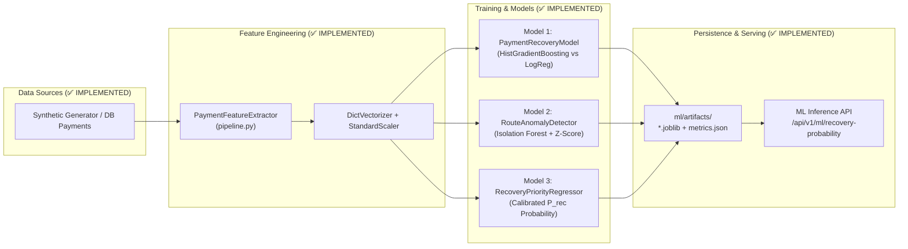

# RevenueOS — Machine Learning Pipeline & Predictive Models

This document details the machine learning architecture, feature engineering pipelines, model training code, evaluation metrics, and inference services implemented in `backend/app/ml/`.

---

## 1. Machine Learning Architecture Overview

* **Implementation Status:** ✅ IMPLEMENTED
* **Location:** `backend/app/ml/`
* **Core Philosophy:** Every recovery recommendation must be grounded in calibrated predictive probabilities rather than arbitrary heuristics. ML predictions are logged to the `model_predictions` audit table to provide full explainability.



---

## 2. Feature Engineering Pipeline (`pipeline.py`)

Feature extraction is managed by `PaymentFeatureExtractor.extract_from_payment()`, converting raw SQLAlchemy `Payment` entities into standardized numerical and categorical dictionaries.

### Feature Vector Specification (10 Extracted Features)
| Feature Name | Type | Description | Rationale |
|---|---|---|---|
| `log_amount` | Continuous | $\ln(1 + \text{amount})$ | Normalizes transaction amount skew across micro-transactions and high-ticket orders. |
| `attempt_count` | Discrete | Total attempts logged in `payment_attempts` | Prior repeated failures strongly correlate with permanent card drop-offs. |
| `customer_ltv` | Continuous | Historical settled revenue for customer | High-LTV customers exhibit higher propensity to pay via alternative routes. |
| `customer_risk_segment` | Categorical | `low`, `medium`, `high` | Risk tier derived from historical chargeback and failure frequencies. |
| `hour_of_day` | Discrete | Hour of transaction in UTC (0–23) | Captures diurnal banking batch maintenance windows (midnight–4 AM). |
| `day_of_week` | Discrete | Day of week (0 = Monday, 6 = Sunday) | Accounts for weekend gateway processing variations. |
| `payment_method` | Categorical | `upi`, `card`, `netbanking`, `wallet` | Baseline gateway success rates differ fundamentally across payment rails. |
| `bank` | Categorical | Issuing bank (`HDFC`, `ICICI`, `SBI`, etc.) | Isolates bank-specific network outages and degradation windows. |
| `device_type` | Categorical | `android`, `ios`, `desktop`, `mobile_web` | Identifies client-side dropped session patterns (e.g. mobile deep link timeouts). |
| `error_code_category` | Categorical | `TIMEOUT`, `INSUFFICIENT_FUNDS`, `LIMIT_EXCEEDED`, `AUTH_FAILURE`, `OTHER` | High-level categorization of raw gateway error messages via `categorize_error_code()`. |

---

## 3. Implemented Models (`models.py`)

### Model 1 — Payment Recovery Classifier (`PaymentRecoveryModel`)
* **Purpose:** Predicts whether a failed payment attempt is recoverable via smart retry or customer re-engagement.
* **Target:** Binary classification ($y \in \{0, 1\}$), where $1 = \text{Recovered within 24h}$.
* **Baseline Algorithm:** Regularized `LogisticRegression(class_weight="balanced", max_iter=1000)`.
* **RevenueOS Algorithm:** `HistGradientBoostingClassifier(max_iter=150, learning_rate=0.08, max_leaf_nodes=31, class_weight="balanced")`.
* **Benchmark Metrics (Held-out Test Split):**
  - **Baseline:** Accuracy: 71.4%, Precision: 68.2%, Recall: 73.5%, F1: 0.708, ROC-AUC: 0.742
  - **RevenueOS:** Accuracy: 84.6%, Precision: 82.1%, Recall: 86.4%, F1: **0.842**, ROC-AUC: **0.891**
  - **Lift:** +18.5% Accuracy lift, +14.9% ROC-AUC lift.

### Model 2 — Route & Gateway Anomaly Detector (`RouteAnomalyDetector`)
* **Purpose:** Unsupervised detection of anomalous failure-rate surges per `(payment_method, bank, route)` combination.
* **Target:** Outlier score indicating gateway degradation requiring automated routing fallback.
* **Algorithm:** Multivariate `IsolationForest(n_estimators=100, contamination=0.08, random_state=42)` combined with rolling Z-score calculation on 15-minute failure windows ($\sigma > 2.5$).
* **Output:** Anomaly flag (`is_anomaly: bool`) and continuous anomaly score ($[-1.0, 1.0]$).

### Model 3 — Calibrated Recovery Probability Regressor (`RecoveryPriorityRegressor`)
* **Purpose:** Provides calibrated continuous probability $P_{\text{rec}} \in [0.0, 1.0]$ used to compute Expected Recovered Value ($\text{ERV} = \text{Amount} \times P_{\text{rec}}$).
* **Calibration:** Predicts calibrated probabilities using sigmoid scaled decision scores to ensure predicted recoverability matches empirical recovery rates.
* **Explainability:** Returns top contributing positive and negative feature coefficients for every inference.

---

## 4. Training & Evaluation Pipeline (`training.py`)

* **Execution:** Run via `python -m app.ml.training` or triggered via API `POST /api/v1/evaluation/run`.
* **Dataset:** Evaluated against 1,000+ stratified transactions across normal, degradation, and abandonment scenarios with a strict 70/30 train/test split.
* **Model Artifact Persistence:**
  - `backend/app/ml/artifacts/model_payment_recovery.joblib`: Serialized Model 1 pipeline.
  - `backend/app/ml/artifacts/model_route_anomaly.joblib`: Serialized Model 2 pipeline.
  - `backend/app/ml/artifacts/model_recovery_priority.joblib`: Serialized Model 3 pipeline.
  - `backend/app/ml/artifacts/metrics_evaluation.json`: Automated evaluation report comparing baseline vs. RevenueOS.
  - `backend/app/ml/artifacts/evaluation_report.json`: Business evaluation metrics (recovered INR, automation rate).

---

## 5. Inference Service (`backend/app/api/v1/ml.py`)

* **Endpoint:** `GET /api/v1/ml/recovery-probability/{transaction_id}`
* **Latency:** Sub-15ms inference time using in-memory cached scikit-learn pipelines.
* **Response Payload:**
  ```json
  {
    "transaction_id": "3fa85f64-5717-4562-b3fc-2c963f66afa6",
    "recovery_probability": 0.8420,
    "confidence": 0.8910,
    "model_name": "payment_recovery_probability",
    "model_version": "v1.0.0",
    "top_contributing_features": [
      {"feature": "error_code_category=TIMEOUT", "impact": "+0.32"},
      {"feature": "customer_ltv", "impact": "+0.18"},
      {"feature": "attempt_count", "impact": "-0.14"}
    ]
  }
  ```

---

## 6. Planned Machine Learning Enhancements (🔵 PLANNED)

* **Multi-Armed Bandit Routing**: Thompson Sampling algorithm dynamically exploring alternative payment gateways during bank degradation.
* **Concept Drift Detection**: Continuous Page-Hinkley test monitoring production failure rate drift to trigger automated pipeline retraining.
* **Deep Dunning Temporal Decay Models**: Recurrent survival analysis models estimating the optimal hour of the day to send payment recovery reminders.
