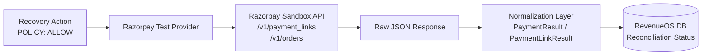

# Razorpay Integration — Test Mode Architecture & Normalization

## 1. Overview & Operational Principles

RevenueOS integrates with Razorpay strictly in **Test/Sandbox Mode**.
Live keys (`rzp_live_...`) and production endpoints are prohibited by deterministic configuration validation, preventing any real-money transaction execution during recovery operations.

### Core Architecture Flow


---

## 2. Test Mode Architecture & Safety Guardrails

### 2.1 Enforced Test Credentials
- **Key ID Prefix:** Must start with `rzp_test_`. Any key prefixed with `rzp_live_` raises a fatal `ValueError` during application boot in `Settings.validate_safety()`.
- **Mode Declaration:** `RAZORPAY_MODE` is locked to `"test"`. If set to `"live"` or any other value, startup is aborted.
- **Fail-Safe Fallback:** If Razorpay API credentials are missing or unconfigured, the system automatically falls back to `MockPaymentProvider`, guaranteeing uninterrupted simulated recovery workflows.

```python
# app/config.py validation
def validate_safety(self):
    if self.RAZORPAY_MODE != "test":
        raise ValueError("SAFETY VIOLATION: RAZORPAY_MODE must be 'test'.")
    if self.RAZORPAY_KEY_ID.startswith("rzp_live_"):
        raise ValueError("SAFETY VIOLATION: Live Razorpay key detected in non-live mode.")
```

---

## 3. Credential Management & Zero Secret Leakage

- **Zero In-Memory & Log Leaks:** API keys, secrets, and webhook secrets are stored only in environment variables (`.env`). They are masked in all REST responses (`/api/v1/payment-provider/status`), serializations, and error logs (`***`).
- **Timing-Attack Resistant Verifications:** Webhook signatures are compared strictly via `hmac.compare_digest`.
- **Masked Diagnostics:** Diagnostic endpoints display:
  ```json
  {
    "requested_mode": "TEST",
    "effective_provider": "razorpay_test",
    "key_id_masked": "rzp_test_****"
  }
  ```

---

## 4. Supported Payment Methods in Test Mode

The Razorpay Test Provider supports simulated execution across standard Indian digital payment methods:
1. **UPI (Unified Payments Interface):** Collect requests, QR intent, and VPA verification in sandbox.
2. **Cards (Credit / Debit):** RuPay, Visa, and Mastercard 3DS test flows.
3. **Netbanking:** Top Tier-1 banks (HDFC, ICICI, SBI, Axis) simulated authorization.
4. **Payment Links:** Dynamic invoice generation (`/v1/payment_links`) with automated SMS/email dispatch simulation.
5. **Subscriptions & Mandates:** Recurring billing mandate test simulations.

---

## 5. Normalized Provider Layer

To shield RevenueOS core business logic from gateway-specific schema variations, all outgoing calls and incoming webhook payloads pass through the **Provider Normalization Layer** (`app/schemas/payment_provider.py`).

### Standard Normalized Models
| Normalized Schema | Core Fields | Purpose |
| :--- | :--- | :--- |
| `PaymentResult` | `provider`, `provider_payment_id`, `provider_order_id`, `amount` (INR), `currency`, `status` | Normalized transaction state |
| `PaymentLinkResult`| `provider_link_id`, `short_url`, `amount`, `status`, `expires_at` | Normalized recovery invoice link |
| `SubscriptionResult`| `provider_subscription_id`, `plan_id`, `status`, `current_start`, `current_end` | Normalized mandate lifecycle |
| `WebhookPayloadNormalized`| `event_name`, `provider_payment_id`, `amount`, `currency`, `status`, `notes` | Normalized incoming webhook event |

### Normalization Guarantees
- **Amount Representation:** Razorpay expresses all amounts in **paise** (integers, e.g. `10000` = ₹100.00). The normalization layer strictly converts paise to `Decimal("100.00")` with 2 decimal places using `quantize_inr()`.
- **Currency Enforcement:** Normalized models validate ISO-4217 `INR`.
- **Timestamps:** Epoch Unix seconds converted to timezone-aware UTC `datetime` objects.

---

## 6. Failure Handling & Circuit Breakers

When the Razorpay Sandbox API experiences simulated outages or network timeouts:
1. **Transient Network Errors:** Retried with exponential backoff (up to 3 times).
2. **Provider Rejection (e.g. Card Expired, Insufficient Funds):** Normalizes failure code (`BAD_REQUEST_ERROR`, `GATEWAY_ERROR`) into RevenueOS error taxonomy.
3. **Hard Failures:** Recorded as a `PaymentAttempt` with error details, immediately flagging the `RecoveryOpportunity` for agent escalation or policy review. Initial API responses are **never** treated as authoritative proof of recovery.

---

## 7. Stage 8 End-to-End Scenarios & Provider Isolation

In Stage 8, Razorpay Test Mode integration is exercised deterministically across all operational scenarios:
- **Canonical Golden Pipeline**: Dispatches 1-click test payment link, captures funds, verifies HMAC-SHA256 signature, and attributes verified recovery.
- **Scenario D (Provider Timeout & Fallback)**: Catches a simulated 504 Gateway Timeout gracefully, transitions initial action to `FAILED`, and reroutes recovery via an alternative payment rail (₹3,499 recovered).
- **Scenario F (Settlement Mismatch)**: Provider settles ₹3,000 for an expected ₹5,000 transaction. Verification is refused, protecting merchant ledger integrity.
- **Strict Sandbox Boundary**: Test mode keys (`rzp_test_*`) are enforced at startup. Live keys (`rzp_live_*`) trigger immediate termination.

