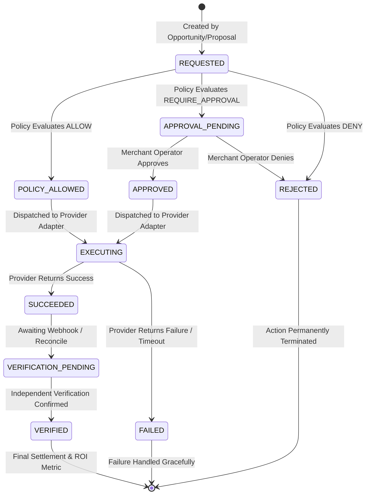

# RevenueOS — Recovery Workflow & Execution Architecture

## 1. End-to-End Recovery Lifecycle

The RevenueOS recovery workflow operates along a deterministic, auditable trajectory spanning 9 agent stages and an explicit action state machine.

```
OBSERVE
   ↓
INVESTIGATE
   ↓
DIAGNOSE
   ↓
QUANTIFY
   ↓
RECOMMEND
   ↓
POLICY_CHECK ──────────┐
   ↓                   │
   ├─► ALLOW ──────────┼─► EXECUTE ──► VERIFY ──► REPORT
   │                   │      ▲
   ├─► REQUIRE_APPR. ──┤      │ (if approved)
   │         ↓         │      │
   │   APPROVAL_QUEUE ─┴──────┘
   │
   └─► DENY ──► HALT_SAFE
```

---

## 2. Action State Machine

Every financial recovery action (`RecoveryAction`) tracks its lifecycle through explicit state transitions:



Invalid state transitions (e.g. `REJECTED` $\rightarrow$ `EXECUTING`, or `VERIFIED` $\rightarrow$ `PENDING`) are strictly forbidden and raise state errors.

---

## 3. Idempotency & Replay Prevention

1. **Idempotency Key Assignment:**
   - Every recovery execution requires a deterministic `idempotency_key` (e.g. `rec_act_uuid4` or `opp_<id>_retry_1`).
   - If the same request is submitted multiple times, the execution service returns the existing action record without re-invoking payment APIs.

2. **Provider Deduplication:**
   - Payment provider adapters enforce key uniqueness at the transport layer.

---

## 4. Payment Provider Abstraction

RevenueOS decouples business logic from payment provider SDKs via the `PaymentProvider` interface:

```
Recovery Executor
       │
       ▼
PaymentProvider (ABC)
       ├── RazorpayTestProvider (Active test harness, strictly test mode)
       └── MockPaymentProvider (Deterministic synthetic responses)
```

### Safety & Test Mode Constraints
- **Zero Real Financial Transactions:** In Stage 5, all executions route through `RazorpayTestProvider` or `MockPaymentProvider`.
- **Live Key Rejection:** Any API key prefix matching `rzp_live_` is rejected at startup.
- **Deterministic Outcomes:** Supports predictable outcomes for testing (e.g. simulating gateway success, card decline, or network timeout).

---

## 5. Independent Verification & ROI Calculation

### Verification Principle
**Execution is never assumed to equal success.** 
After an action executes:
1. Provider response is recorded (`SUCCEEDED`).
2. An independent verification step (`verify_action_outcome`) queries the actual payment state or awaits an HMAC-verified webhook.
3. Only upon independent confirmation does status advance to `VERIFIED`.

### Financial Metric Distinctions
- **Revenue at Risk (RAR):** Total monetary volume exposed to systemic or transient failure.
- **Expected Recovery Value (ERV):** Model-derived mathematical expectation: $\text{ERV} = \text{Gross Amount} \times P_{\text{rec}}$.
- **Actual Recovered Revenue:** Settled currency confirmed strictly by verified payment provider receipts.

### Transparent ROI Formula
$$\text{ROI} = \frac{\text{Actual Recovered Revenue} - \text{Recovery Cost}}{\text{Recovery Cost}}$$

If recovery cost is zero (e.g. software automation overhead negligible):
$$\text{Recovery Yield Ratio} = \frac{\text{Actual Recovered Revenue}}{\text{Revenue at Risk}}$$

---

## 6. Causal Trace Architecture

Every agent execution binds all telemetry, predictions, decisions, actions, and receipts under a single `causal_trace_id`:

```
trace_c30fb9...
 ├── Leak Detected (Payment Failure Spike)
 ├── Agent Run Started (OBSERVE)
 ├── Evidence Gathered (INVESTIGATE: UPI Timeout on HDFC)
 ├── Diagnosis Generated (DIAGNOSE: Gateway degradation)
 ├── Recovery Opportunity Ranked (QUANTIFY: ERV = ₹1,272)
 ├── Policy Check (POLICY_CHECK: ALLOW, policy_v1)
 ├── Recovery Action (EXECUTING: RazorpayTestProvider)
 ├── Verification (VERIFY: Confirmed captured)
 └── Financial Lift Attributed (REPORT: ₹1,590 Actual Recovery)
```
