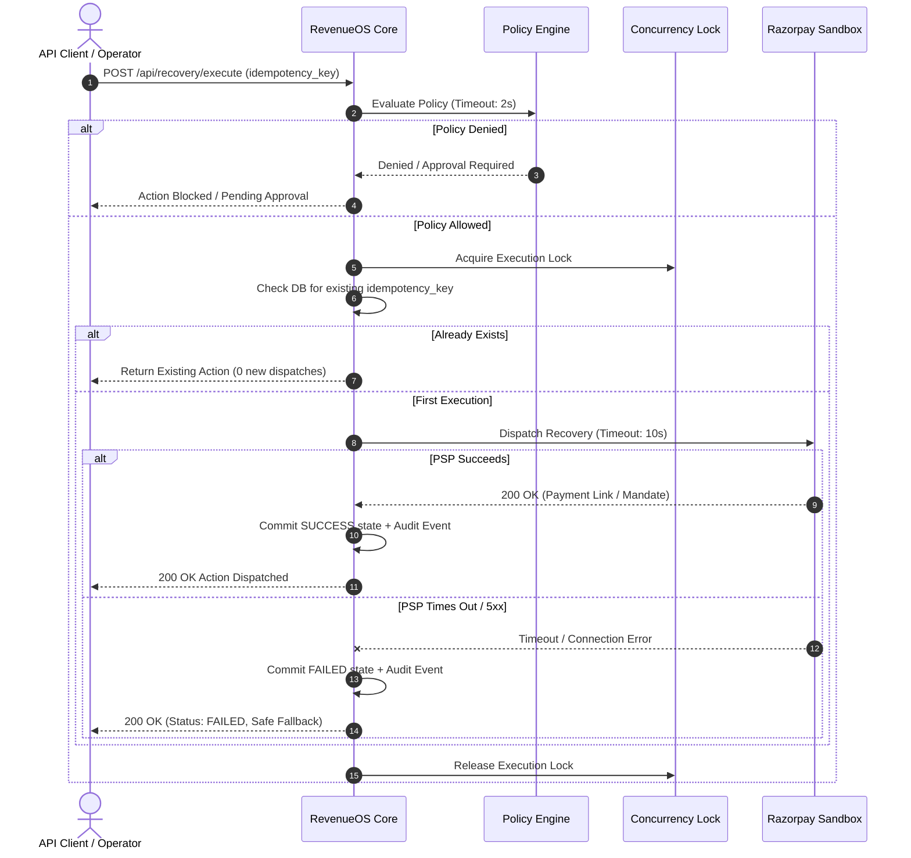

# RevenueOS Reliability, Fault Tolerance & Resilience Architecture

## 1. Core Reliability Philosophy: Fail CLOSED
In financial technology and revenue recovery systems, **an unexecuted recovery is vastly preferable to an uncontrolled, duplicate, or unauthorized financial transaction**.

RevenueOS enforces a strict **Fail CLOSED** policy across all components:
1. If identity is unverified $\rightarrow$ **Reject (HTTP 401)**.
2. If authorization or tenant ownership is ambiguous $\rightarrow$ **Reject (HTTP 403)**.
3. If policy engine evaluation encounters an unexpected exception $\rightarrow$ **Action BLOCKED**.
4. If payment gateway status is indeterminate (e.g. HTTP 504 Gateway Timeout) $\rightarrow$ **Action marked FAILED or PENDING_RECONCILIATION; NEVER falsely mark SUCCESS**.
5. If the AI agent encounters an error, invalid JSON, or timeouts $\rightarrow$ **Halt agent execution cleanly; trigger zero financial operations**.

---

## 2. Component Failure Matrix & Resilient Behaviors

| Component | Failure Mode | Impact | Degradation & Recovery Strategy |
| :--- | :--- | :--- | :--- |
| **Payment Provider (Razorpay)** | 504 Gateway Timeout / 500 Error / Network Outage | Action execution cannot reach PSP | - Mark `RecoveryAction.status = FAILED` - Result logged with provider error code - Trigger fallback recommendation (e.g. alternative banking rail) - Never claim recovered revenue without verified provider response |
| **Database (SQLite / Postgres)** | Lock timeout / Disk I/O / Disconnect | Transaction cannot commit | - Atomic `db.rollback()` triggered in exception handlers - Returns HTTP 503 / 500 clean JSON error; zero partial state persisted - Idempotency key preserved in client to safely retry |
| **AI LLM Agent** | API Timeout / Token Limit / Malformed JSON / Loop Limit | Agent cannot produce structured recommendation | - Maximum loop iteration cap (10 turns) enforced - Hard timeout (30 seconds) on LLM inference - Agent terminates safely; logs `agent_run_failed` audit event - Existing confirmed financial state remains completely unaffected |
| **ML Intelligence Service** | Model prediction failure / Missing features | Missing recovery probability | - Fallback to deterministic heuristic baseline (0.50 default confidence) - Triggers Policy Engine Rule 6: Confidence < 60% requires explicit merchant approval |
| **Incoming Webhook Delivery** | Network drop / Delay / Replay | Out-of-order or duplicate webhook events | - Webhooks verified via constant-time HMAC-SHA256 - Database constraint on `event_id` ensures idempotent processing - Out-of-order delivery rule: Webhook cannot downgrade a terminal SUCCESS to FAILED |

---

## 3. Timeout & Retry Policy

### Timeout Budgets
- **Internal API Endpoints**: 5,000ms max latency budget.
- **External PSP (Razorpay HTTP)**: 10,000ms socket timeout with bounded retry count (max 2 retries with exponential backoff).
- **AI Agent Tool Execution**: 15,000ms total workflow timeout.
- **Database Query Timeout**: 3,000ms max execution time per statement.

### Retry Rules
1. **Financial Action Mutations**:
   - MUST NOT be automatically retried in a tight loop without merchant policy re-evaluation.
   - Max gateway retries per opportunity: 3 attempts.
   - Cooldown period: Minimum 300 seconds between active retries on the same payment method.
2. **Read-Only Enquiries**:
   - Bounded exponential backoff ($1s, 2s, 4s$) up to 3 attempts.

---

## 4. Idempotency Under High Concurrency

To ensure reliability during concurrent spikes or network retries, RevenueOS utilizes two complementary defenses:
1. **Thread-Safe Critical Section Locking**:
   - `RecoveryExecutor._execution_lock` coordinates in-flight requests within the application process.
   - In automated load tests with 20 simultaneous threads presenting identical idempotency keys, exactly ONE recovery action is created and dispatched to the gateway. The remaining 19 threads receive the existing record.
2. **Database Unique Constraints**:
   - `idempotency_key` is uniquely indexed in `recovery_actions`.
   - `event_id` is uniquely indexed in `webhook_events`.

---

## 5. Application Restart & State Recovery

When the application process restarts (e.g. after a crash, container recycling, or deployment):
1. **In-Flight Actions**: Any action left in `executing` status during an abrupt server kill will be reconciled upon receiving the next provider webhook or during the scheduled background reconciliation poll.
2. **Deterministic State Rebuilding**: All metrics, leak records, and recovery opportunities are anchored to immutable database tables (`payments`, `revenue_leaks`, `audit_events`). No state is lost upon server restart.
3. **Database Schema Auto-Migration**: On startup, `Base.metadata.create_all(bind=engine)` guarantees all necessary indices, tables, and constraints are present before accepting HTTP traffic.

---

## 6. Stage 8 Fault Tolerance & Fallback Scenarios

RevenueOS incorporates multi-tier fault recovery tested across negative scenarios:
- **Provider Outage & Route Fallback (Scenario D)**: Catches upstream 504 Gateway Timeouts, marks initial recovery action `FAILED`, generates forensic failure diagnostics, and selects an alternative bounded rail (recovering ₹3,499.00).
- **Approval Queue Timeout**: High-value transactions awaiting manual operator sign-off (`PENDING_APPROVAL`, Scenario C) do not expire silently; they remain bounded in the operator queue until explicit sign-off or cancellation.
- **Webhook Network Glitches (Scenario E)**: Idempotency ledger handles repeated network retries safely, returning `idempotent_duplicate` without redundant ledger writes.

