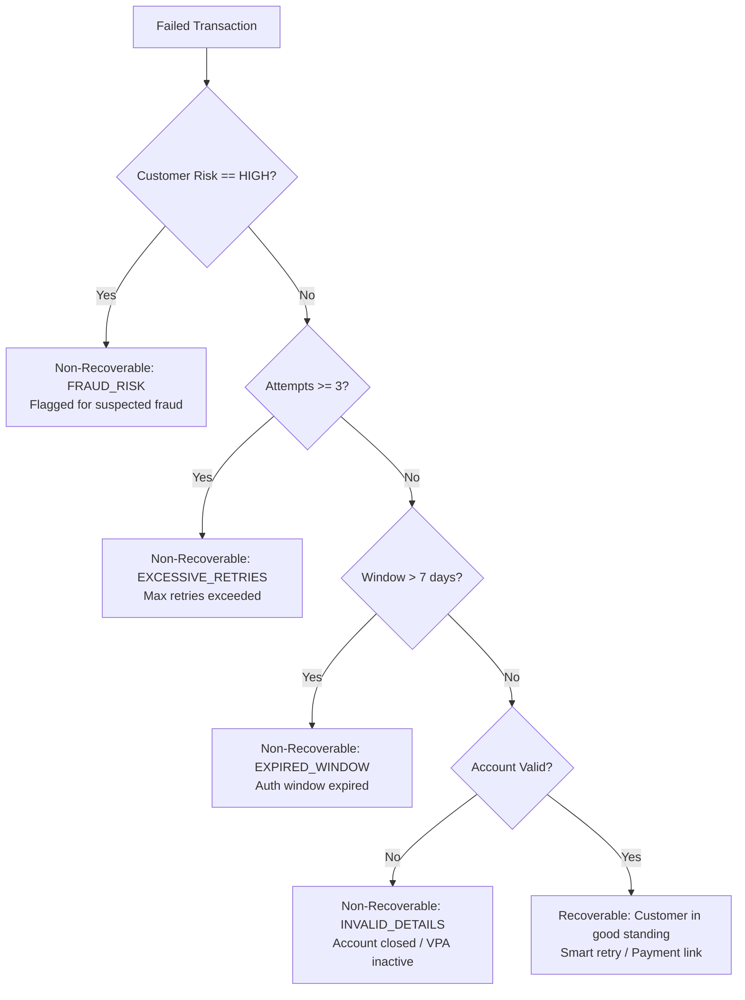

# RevenueOS — Synthetic Revenue Data & Loss Simulation (Stage 2)

This document specifies the synthetic commerce environment, scenario models, ground truth registries, data quality validation, and CLI commands implemented in `backend/app/synthetic/` for RevenueOS Stage 2.

---

## 1. Objective & Purpose

RevenueOS requires transaction-level synthetic data to realistically simulate merchant revenue losses, train ML models, test policy rules, and validate autonomous AI recovery workflows.

Instead of hardcoded UI demo mocks, RevenueOS implements an end-to-end, transaction-level synthetic data generator that creates:
* Realistic customer cohorts and transaction histories.
* Controlled, multi-dimensional payment degradation clusters.
* Funnel-level checkout session abandonments.
* Auto-debit recurring subscription mandate failures.
* High-ticket recoverable payment failures.
* Non-recoverable failures (fraud risk, excessive retries, expired authorization windows, deregistered accounts).
* Explicit ground truth annotations stored out-of-band for benchmarking and evaluation.

> [!IMPORTANT]
> **Strict Distinction: Synthetic Data vs. Real Razorpay Data**
> * All synthetic transactions, customers, payments, and subscriptions are generated locally in the SQLite/PostgreSQL database via `SyntheticDataGenerator`.
> * Customer references are prefixed with `cust_syn_`, and payment attempts model gateway error codes defined by Razorpay API specifications (e.g. `BAD_REQUEST_GATEWAY_TIMEOUT`, `MANDATE_LIMIT_EXCEEDED`).
> * No live customer funds, live banking rails, or production Razorpay credentials are used during synthetic generation.
> * Ground truth labels are strictly isolated in memory/evaluation registries and are never consumed by production leak detection or policy engines.

---

## 2. Generator Architecture

The generator is located in `backend/app/synthetic/` and comprises the following modular components:

| Module | Purpose |
|---|---|
| [`generator.py`](file:///k:/Documents/Razorpay/RevenueOS/backend/app/synthetic/generator.py) | Core engine implementing `SyntheticDataGenerator` and the standardized `generate_scenario(db, scenario, seed)` API. |
| [`scenarios.py`](file:///k:/Documents/Razorpay/RevenueOS/backend/app/synthetic/scenarios.py) | Scenario presets, seed offsets, merchant profiles, and cluster injection rules. |
| [`ground_truth.py`](file:///k:/Documents/Razorpay/RevenueOS/backend/app/synthetic/ground_truth.py) | Strongly-typed dataclasses (`ScenarioGroundTruth`, `TransactionGroundTruth`) and `GroundTruthRegistry`. |
| [`validation.py`](file:///k:/Documents/Razorpay/RevenueOS/backend/app/synthetic/validation.py) | Automated 10-dimension dataset integrity verification and dynamic SQL-computed observed metrics. |
| [`cli.py`](file:///k:/Documents/Razorpay/RevenueOS/backend/app/synthetic/cli.py) | Developer CLI for generating, resetting, and validating synthetic datasets. |

### Relational Hierarchy Produced
```
Merchant
  ├── Customer
  │     ├── Payment
  │     │     └── PaymentAttempt (1..N)
  │     ├── Subscription
  │     │     └── SubscriptionAttempt (1..N)
  │     └── CheckoutSession
  ├── RevenueLeak
  │     └── RecoveryOpportunity
  │           ├── AgentDecision
  │           ├── PolicyDecision
  │           └── RecoveryAction
  └── AuditEvent
```

---

## 3. Seed & Deterministic Reproducibility

Determinism is critical for reproducible regression tests, model training, and consistent demo presentations:
* **Anchor Datetime:** The generator uses a fixed anchor timestamp (`2026-09-01T12:00:00Z`) rather than wall-clock time (`datetime.now()`). All transactions, checkout sessions, and attempts are offset relative to this anchor.
* **Isolated PRNG:** Each scenario uses a dedicated `random.Random(seed + seed_offset)` instance. Generation does not mutate global Python PRNG state.
* **UUID Determinism:** All UUIDv4 identifiers are generated from deterministic PRNG byte streams via `gen_uuid(rng)`.

### Verification Guarantee
* Running `generate_scenario(db, scenario="healthy", seed=42)` twice produces identical customer IDs, transaction counts, failure rates, and amounts.
* Running with `seed=99` produces a distinct, non-identical dataset.

---

## 4. Scenario Catalog

The generator models six distinct commerce scenarios:

### Scenario 1: `healthy` (`healthy_merchant` — Apex Electronics)
* **Description:** Normal baseline merchant with natural variation across devices, payment methods, and ticket sizes.
* **Characteristics:** Failure rate ~3–4%, balanced across banks and rails. Zero anomalous degradation clusters.

### Scenario 2: `payment_degradation` (`payment_degradation` — TrendStyle Apparel)
* **Description:** Severe payment rail degradation affecting a specific cluster.
* **Injected Cluster:** Bank: `HDFC` | Method: `UPI` | Device: `Android` | Time: Evening (18:00–22:00 UTC) | Route: `hdfc_upi_direct`.
* **Behavior:** Cluster failure rate spikes to ~75% with error code `BAD_REQUEST_GATEWAY_TIMEOUT`, while baseline control failure rate remains ~4%.

### Scenario 3: `checkout_abandonment` (`checkout_abandonment` — LuxeLiving Home)
* **Description:** High-value cart drop-offs at critical checkout stages.
* **Characteristics:** High cart values (INR 15,000–85,000). Abandonment rate spikes to ~58–60%, concentrated at `otp_entry` (65%) and `payment_method_select` (35%) stages.

### Scenario 4: `subscription_failure` (`subscription_spike` — CloudFlow SaaS)
* **Description:** Recurring auto-debit renewal spike on subscription mandates.
* **Characteristics:** Subscription renewal failure rate spikes to ~45–46%, driven by `MANDATE_LIMIT_EXCEEDED` (50%), `CARD_EXPIRED` (30%), and `INSUFFICIENT_FUNDS` (20%).

### Scenario 5: `high_value_recovery` (`high_value_recoverable` — Titan B2B Industrial)
* **Description:** High-ticket B2B transactions (INR 35,000–175,000) with transient failures.
* **Characteristics:** Payments exceed single-transaction limits (`EXCEEDS_TRANSACTION_LIMIT`), followed by successful recovery via payment links and alternative routing.

### Scenario 6: `mixed` (`mixed_multi_issue` — OmniCommerce India)
* **Description:** Multi-channel enterprise merchant experiencing concurrent payment route degradation, checkout cart drop-offs, and subscription renewal failures.
* **Characteristics:** 400 payments, 80 checkout sessions, 60 subscriptions with combined failure patterns.

---

## 5. Recoverable vs. Non-Recoverable Cases

RevenueOS explicitly differentiates recoverable losses from non-recoverable transactions so that downstream AI agents learn that doing nothing is often the correct, policy-compliant decision.



### Non-Recovery Reasons (`NonRecoveryReason` Enum)
1. `FRAUD_RISK`: High-risk customer or suspected fraudulent velocity. Error code: `FRAUD_DETECTED`.
2. `EXCESSIVE_RETRIES`: Customer has already attempted 3–4 times. Error code: `MAX_RETRIES_EXCEEDED`.
3. `EXPIRED_WINDOW`: Transaction created > 7 days ago. Error code: `AUTHORIZATION_EXPIRED`.
4. `INVALID_DETAILS`: Permanently invalid bank rail or closed account. Error code: `ACCOUNT_CLOSED`.
5. `USER_CANCELLED`: Customer explicitly aborted the transaction.
6. `POLICY_PROHIBITED`: Merchant or network policy prohibits automated retry.

---

## 6. Ground Truth Isolation

Ground truth records what was actually injected into the database and what the ideal detector/recovery system should find.

### Ground Truth Structures (`ground_truth.py`)
* `ScenarioGroundTruth`: Records baseline failure rates, incident failure rates, affected dimensions, affected transaction IDs, customer IDs, and total recoverable vs. non-recoverable monetary volume.
* `TransactionGroundTruth`: Per-transaction annotation (`is_affected_by_incident`, `is_recoverable`, `non_recovery_reason`, `expected_action`).
* `SubscriptionGroundTruth`: Per-subscription annotation (`is_affected`, `mandate_failure_reason`).
* `CheckoutGroundTruth`: Per-checkout session annotation (`is_abandoned`, `stage_dropped`).
* `GroundTruthRegistry`: Thread-safe singleton registry storing ground truth indexed by `merchant_id` and `transaction_id`.

> [!CAUTION]
> **Zero Production Leakage**
> Production leak detectors, ML models, and recovery executors query only standard database tables (`payments`, `payment_attempts`, `subscriptions`, `checkout_sessions`). They never import or read `GroundTruthRegistry`.

---

## 7. Data Quality & Integrity Validation

The validation engine in `backend/app/synthetic/validation.py` performs 10 automated consistency checks:

1. **Foreign Key Integrity:** Zero orphan records across payments, attempts, subscriptions, and checkouts.
2. **Chronological Validity:** `PaymentAttempt.attempted_at >= Payment.created_at`.
3. **Monetary Precision:** All amounts positive (`> 0.00`) and quantized to 2 decimal places.
4. **Status Lifecycle:** Valid enum values for payments (`success`, `failed`, `recovered`, `pending`).
5. **Subscription Consistency:** Subscription attempts have valid status (`success`, `failed`) and valid cycle strings.
6. **Checkout Session Consistency:** Abandoned sessions must record a valid `stage_dropped`.
7. **Attempt Number Continuity:** Payment attempts follow strictly sequential attempt numbers (`1, 2, ...`).
8. **Customer Association:** All customer records map to a valid merchant.
9. **No Duplicate Primary Keys:** Primary key uniqueness enforced across all tables.
10. **Ground Truth Validation:** Every ID in `ScenarioGroundTruth.affected_transaction_ids` exists in the database.

---

## 8. Observed Metrics Computation

Observed metrics are dynamically calculated via SQL aggregations in `calculate_observed_metrics(db, merchant_id)`:

* **Payment Failure Rate:** `COUNT(failed) / COUNT(total)`
* **Cluster Degradation Rate:** Failure rate of `(HDFC, UPI, Android, 18-22h)` vs. control group
* **Failed / Recoverable / Non-Recoverable Volumes:** Summed from individual transaction amounts
* **Checkout Abandonment Rate:** `COUNT(abandoned) / COUNT(total_sessions)`
* **Lost Cart Value:** `SUM(cart_value)` for abandoned sessions
* **Subscription Churn / Failure Rate:** `COUNT(failed) / COUNT(total_subscriptions)`
* **Affected MRR:** `SUM(plan_amount)` for failed subscriptions

---

## 9. CLI Usage & Demo Commands

### Generate Demo Data
```bash
# Generate all scenarios with default seed 42
python -m app.synthetic.cli generate-demo-data --seed 42

# Generate a specific scenario
python -m app.synthetic.cli generate-demo-data --scenario payment_degradation --seed 42

# Generate the mixed enterprise scenario
python -m app.synthetic.cli generate-demo-data --scenario mixed --seed 42
```

### Validate Data Integrity & View Observed Metrics
```bash
python -m app.synthetic.cli validate-data
```

### Reset Database
```bash
python -m app.synthetic.cli reset-demo-data --seed 42
```

---

## 10. Verification & Test Suite

Stage 2 is verified by 11 comprehensive automated tests in `backend/tests/test_stage2_synthetic.py`:

| Test | Description |
|---|---|
| `test_1_deterministic_generation` | Confirms identical database rows generated across repeated seed=42 runs. |
| `test_2_differing_seeds_diverge` | Confirms seed=42 and seed=99 produce different payment amounts and customer counts. |
| `test_3_healthy_scenario` | Verifies healthy merchant baseline failure rate <= 7% and zero cluster degradation. |
| `test_4_payment_degradation` | Verifies target cluster failure rate >= 60% with gateway timeout error code. |
| `test_5_checkout_abandonment` | Verifies cart abandonment rate >= 50% clustered at OTP and payment method stages. |
| `test_6_subscription_failure` | Verifies recurring mandate failure rate >= 30% with mandate error codes. |
| `test_7_high_value_recovery` | Verifies high-ticket recoverable payments and success on recovery retry. |
| `test_8_non_recoverable_transactions` | Verifies presence of non-recoverable transactions (fraud, retries, expired, invalid). |
| `test_9_mixed_scenario` | Verifies multi-issue enterprise merchant with concurrent payment, checkout, and sub issues. |
| `test_10_data_integrity` | Runs full 10-dimension automated dataset integrity validation. |
| `test_11_ground_truth_integrity` | Verifies ground truth annotations, recoverable monetary split, and registry lookup. |

To run the complete Stage 1 + Stage 2 suite:
```bash
python -m pytest backend/tests/ -v
```
All 153 tests execute in under 30 seconds with 100% pass rate.
