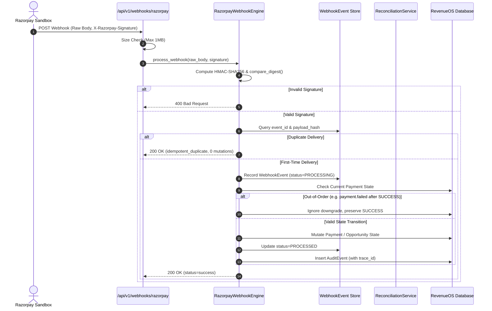

# Webhook Engine — Ingestion, Deduplication & Verification

## 1. Webhook Engine Architecture

The RevenueOS Webhook Engine is the critical asynchronous feedback loop that ingests real-time events from payment providers (Razorpay Test Sandbox), verifies authenticity, enforces strict idempotency, and mutates internal recovery states transactionally.



---

## 2. Cryptographic Signature Verification

Every incoming webhook request MUST supply the `X-Razorpay-Signature` header.
- **Algorithm:** HMAC-SHA256.
- **Key:** Merchant webhook secret (`RAZORPAY_WEBHOOK_SECRET`).
- **Input Data:** The exact raw, unparsed request body bytes (`bytes`). Parsing JSON before signature computation is prohibited as key-sorting or whitespace changes invalidate HMAC.
- **Constant-Time Comparison:** Verification uses Python's `hmac.compare_digest(computed, signature_header)` to prevent side-channel timing attacks.

```python
# app/services/webhook_engine.py
def verify_signature(raw_body: bytes, signature: str, secret: str) -> bool:
    if not signature or not secret:
        return False
    expected = hmac.new(secret.encode("utf-8"), raw_body, hashlib.sha256).hexdigest()
    return hmac.compare_digest(expected.lower(), signature.strip().lower())
```

---

## 3. Supported Webhook Events & State Transitions

| Webhook Event | Entity Type | State Mutation in RevenueOS | Recovery Triggered |
| :--- | :--- | :--- | :--- |
| `payment.authorized` | `payment` | Marks `Payment` as `AUTHORIZED`. Stores `provider_payment_id`. | No |
| `payment.captured` | `payment` | Marks `Payment` as `SUCCESS`. Normalizes amount & currency. | No |
| `payment.failed` | `payment` | Marks `Payment` as `FAILED`. Appends `PaymentAttempt` with error code. | **Yes** — activates `RecoveryOpportunity` |
| `payment_link.paid` | `payment_link` | Marks linked `RecoveryOpportunity` as `RECOVERED`. Transitions `Payment` to `RECOVERED`. | No (Resolves Opportunity) |
| `payment_link.expired` | `payment_link` | Marks link expired. Flags opportunity for alternative action. | **Yes** — re-triggers policy evaluation |
| `subscription.charged`| `subscription`| Updates `Subscription` status to `ACTIVE`. Updates next billing date. | No |
| `subscription.halted` | `subscription`| Marks `Subscription` as `FAILED`. | **Yes** — creates mandate recovery opportunity |

---

## 4. Idempotency & Deduplication Guarantees

Gateways frequently retry webhooks up to 5 times if network delivery acknowledges slowly. RevenueOS guarantees **strictly-once** state processing:
1. **Deduplication Keys:** Incoming events are indexed by:
   - `event_id`: Gateway-provided unique event identifier (e.g. `evt_abc123`).
   - `payload_hash`: SHA-256 hash of raw payload bytes (`hashlib.sha256(raw_body).hexdigest()`).
2. **Duplicate Detection:**
   - If `event_id` exists in the database and `processed == True`:
   - Returns HTTP 200 with `status: "idempotent_duplicate"`.
   - **Zero state transitions, zero database writes, and zero duplicate recovery actions occur.**

---

## 5. Out-of-Order Delivery Protection

Due to asynchronous network routing, a `payment.failed` event may arrive **after** a successful re-attempt has already marked the payment `SUCCESS` or `RECOVERED`.
- **Protection Rule:** If the current `payment.status` is `SUCCESS` or `RECOVERED`:
  - Incoming `payment.failed` events are logged as out-of-order anomalies.
  - The payment state is **never downgraded**.
  - Internal reconciliation status remains intact.

---

## 6. Abuse Prevention & Payload Limits

- **Payload Size Protection:** Requests exceeding **1 Megabyte (1,048,576 bytes)** are immediately rejected with HTTP `413 Content Too Large` before memory allocation or parsing.
- **Zero Secret Exposure:** Webhook headers and request dumps scrub all authorization headers and secrets before logging.
- **Transactional Failure Safety:** If an unhandled exception occurs during event processing:
  - Database mutations are automatically rolled back (`db.rollback()`).
  - The event record is safely updated to `processing_status = "PROCESSING_FAILED"` with sanitized error details for audit and operational replay.

---

## 7. Stage 8 Webhook Idempotency & Replay Protection

Demonstrated in **Scenario E**:
1. **Duplicate Webhook Detection**: When an identical HMAC webhook payload is resent with an already processed `event_id`, the engine returns:
   ```json
   {
     "status": "idempotent_duplicate",
     "event_id": "evt_replay_...",
     "message": "Webhook event evt_replay_... was already successfully processed."
   }
   ```
2. **Zero Redundant Mutations**: Idempotent duplicate returns bypass state transition logic entirely, guaranteeing zero duplicate ledger credits or balance updates.
3. **Audit Ledger Verification**: An immutable `AuditEvent` (`webhook_duplicate_suppressed`) is written with the matching request ID.

